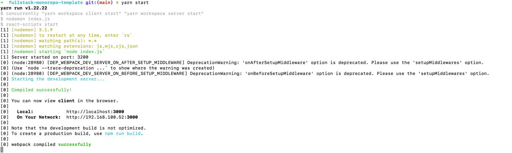

# Fullstack monorepo template for React.js + Node.js project

## Yarn workspaces
Yarn workspaces been used to handle packages in the monorepo.
[More here](https://yarnpkg.com/features/workspaces)

#### How to start the project ? (Run CMDs in the project root directory)
1. Install all dependencies:
```shell
  yarn install
```
2. Start the project
```shell
  yarn dev
```

#### How to add new package to your workspace?
To add new package to your workspace just update root package.json workspaces property with new item.

```json

{
  "workspaces": [
    "client",
    "server",
    "<my-new-package>"
  ]
}
  ```
 #### How to add new dependency to particular package?
```shell
     yarn workspace server add @internal/entities
```

 #### How to start single workspace package?

To start React.js frontend package:
```shell
  yarn workspace client start
```

To start Node.js server package:
```shell
  yarn workspace server dev
```
  
#### How to start whole workspace locally?
To run worksace packages independently and in the same time, I'm using "concurrently" util
[npm pkg here](https://www.npmjs.com/package/concurrently)
So, If you'll need to add one more package to startup script just update root package.json accordingly 
```json
{
  "scripts": {
    "dev": "concurrently \"yarn workspace client start\" \"yarn workspace server start\""
  }
}
```

